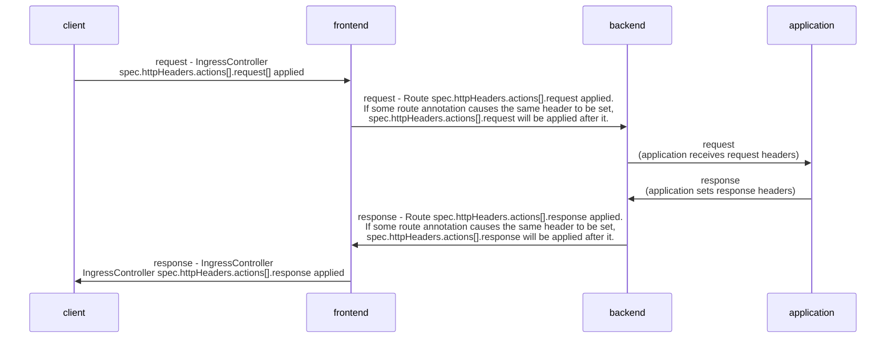

# Demo for HTTP Headers EP

You can set or delete HTTP Request or Response headers either for all routes served by an Ingress Controller or for specific routes.

Goal: Extend the IngressController and Route APIs to allow setting and deleting HTTP request and response headers.

Motivation: Enable an application owner or cluster admin
- to meet security compliance requirements; 

- to protect against cross-site scripting attacks;
  For example: One may want to HTTP response header called Content Security Policy (CSP) is a security feature that is used to specify the
  origin of content that is allowed to be loaded on a website or in a web applications. It is an added layer of security that helps to 
  detect and mitigate certain types of attacks, including Cross-Site Scripting (XSS) and data injection attacks.
  These attacks are used for everything from data theft to site defacement to distribution of malware.

- to provide client connection information to backend servers; 
  For example: One may want to insert SSL Client Certificate information into the HTTP headers using the `x-ssl-client-der` when mtls is enabled.

- to hide information about backend servers from clients.
  For example: One might want to add X-Frame-Options HTTP response header to indicate whether a browser should be allowed to render a page in 
  a `<frame>, <iframe>, <embed> or <object>`. Sites can use this to avoid clickjacking attacks, by ensuring that their content is not 
  embedded into other sites.

### Steps to run the go based server app

Create a deployment for a go based server app.
```sh
oc apply -f deployment.yaml
```

Create a service.
```sh
oc apply -f services.yaml
```

Create a route.
```sh
[miheer@localhost mtls]$ oc create route edge --service=myapp-service --hostname=myapp-service-demo.apps.misalunk-demo.qe.devcluster.openshift.com  
route.route.openshift.io/myapp-service created
[miheer@localhost mtls]$ 
[miheer@localhost mtls]$ 
[miheer@localhost mtls]$ oc get routes
NAME            HOST/PORT                                                           PATH   SERVICES        PORT    TERMINATION   WILDCARD
myapp-service   myapp-service-demo.apps.misalunk-demo.qe.devcluster.openshift.com          myapp-service   <all>   edge          None
```

### Test HTTP Request

As a cluster admin or route owner, I want to enable mutual TLS but replace the "x-ssl-client-der" request header that OpenShift router 
adds with an "x-forwarded-client-cert" request header that my application checks for, so that I can migrate my applications that rely on 
mutual TLS and use the latter header name.

The following example replaces "x-ssl-client-der" with "x-forwarded-client-cert":

Pre-requisites:

Enable mtls as per https://rcarrata.com/openshift/mtls-ingress-controller/

Edit the route:
```sh
[miheer@localhost mtls]$ oc edit route myapp-service
```

```yaml
spec:
  host: myapp-service-demo.apps.misalunk-demo.qe.devcluster.openshift.com
  httpHeaders:
    actions:
      request:
        - action:
            set:
              value: '%{+Q}[ssl_c_der,base64]'
            type: Set
          name: x-forwarded-client-cert
        - action:
            type: Delete
          name: x-ssl-client-der
      response: null
```
- httpHeaders: Defines the list of the HTTP request and response on which we want to set or delete.
- actions: Defines list of actions to set or delete the HTTP request and response.
- request: Defines the type of the HTTP headers.
- action: Defines the action for the header in detail.
- set: Defines the details for action set if the type of the action was `Set`
- value: Defines the value for the header if the type of the action was `Set`
- type: Defines type of the action either `Set` or `Delete`
- name: Defines the name of the header on which the action shall be performed.

Run curl command as follows to check if the `x-ssl-client-der` was replaced with `x-forwarded-client-cert`:
```sh
[miheer@localhost mtls]$ curl --cacert certs/cacert.pem --cert certs/client.cert.pem --key private/client.key.pem  -v https://myapp-service-demo.apps.misalunk-demo.qe.devcluster.openshift.com -k

```
In the last line you can see the request header `x-forwarded-client-cert` was set.
It was sent to the app which wrote the request headers it received to the response body so that we can see the request headers sent to
the backend using the curl command rather than accessing the app and doing `oc logs` of the application pod.


### Test HTTP Response

As an application or route owner, I want to enable a web application to serve content of an alternative location for providing language
translation.

The following procedure creates a route that sets the Content-Location HTTP header so that response to the 
`https://app.example.com` mentions to the client that `https://app.example.com/lang/en-us` is available to access
the content in Chinese. 

Run `oc edit route` and add the following under spec as follows:

```sh
      response: 
      - action:
          set:
            value: /lang/zh-cn  
          type: Set
        name: Content-Location

```

Check if the response header is set.
```sh
[miheer@localhost demo-headers]$ curl -vk http://myapp-service-default.apps.misalunk-demo.qe.devcluster.openshift.com/
*   Trying 3.131.174.9:80...
* Connected to myapp-service-default.apps.misalunk-demo.qe.devcluster.openshift.com (3.131.174.9) port 80 (#0)
> GET / HTTP/1.1
> Host: myapp-service-default.apps.misalunk-demo.qe.devcluster.openshift.com
> User-Agent: curl/7.85.0
> Accept: */*
> 
* Mark bundle as not supporting multiuse
< HTTP/1.1 200 OK
< date: Mon, 27 Nov 2023 04:11:12 GMT
< content-length: 421
< content-type: text/plain; charset=utf-8
< content-location: /lang/zh-cn
< set-cookie: 8611d729d92414ce206557cd0e8d223b=b91e6585b115ec99590e1c63962e1dff; path=/; HttpOnly
< 
Hello, Kubernetes!
map[Accept:[text/html, application/xhtml+xml, application/xml;q=0.9, image/webp, */*;q=0.8] Forwarded:[for=14.200.245.158;host=myapp-service-default.apps.misalunk-demo.qe.devcluster.openshift.com;proto=http] User-Agent:[curl/7.85.0] X-Forwarded-For:[14.200.245.158] X-Forwarded-Host:[myapp-service-default.apps.misalunk-demo.qe.devcluster.openshift.com] X-Forwarded-Port:[80] X-Forwarded-Proto:[http]]
* Connection #0 to host myapp-service-default.apps.misalunk-demo.qe.devcluster.openshift.com left intact
[miheer@localhost demo-headers]$ 
```

In the above curl output it can be been seen that `content-location: /lang/zh-cn` has been set in the HTTP Response which
mentions the user to navigate to http://myapp-service-demo.apps.misalunk-demo.qe.devcluster.openshift.com/lang/zh-cn to 
access web content written in Chinese.

Test the alternative location:
```sh
[miheer@localhost demo-headers]$ curl -vk http://myapp-service-default.apps.misalunk-demo.qe.devcluster.openshift.com/lang/zh-cn
*   Trying 3.131.174.9:80...
* Connected to myapp-service-default.apps.misalunk-demo.qe.devcluster.openshift.com (3.131.174.9) port 80 (#0)
> GET /lang/zh-cn HTTP/1.1
> Host: myapp-service-default.apps.misalunk-demo.qe.devcluster.openshift.com
> User-Agent: curl/7.85.0
> Accept: */*
> 
* Mark bundle as not supporting multiuse
< HTTP/1.1 200 OK
< date: Mon, 27 Nov 2023 04:11:04 GMT
< content-length: 429
< content-type: text/plain; charset=utf-8
< content-location: /lang/zh-cn
< set-cookie: 8611d729d92414ce206557cd0e8d223b=b91e6585b115ec99590e1c63962e1dff; path=/; HttpOnly
< 
你好 kubernetes http/1.1
map[Accept:[text/html, application/xhtml+xml, application/xml;q=0.9, image/webp, */*;q=0.8] Forwarded:[for=14.200.245.158;host=myapp-service-default.apps.misalunk-demo.qe.devcluster.openshift.com;proto=http] User-Agent:[curl/7.85.0] X-Forwarded-For:[14.200.245.158] X-Forwarded-Host:[myapp-service-default.apps.misalunk-demo.qe.devcluster.openshift.com] X-Forwarded-Port:[80] X-Forwarded-Proto:[http]]
* Connection #0 to host myapp-service-default.apps.misalunk-demo.qe.devcluster.openshift.com left intact
```

### Over-ride behavior

When the same HTTP header is modified both in the Ingress Controller and in a route, HAProxy prioritizes the actions in certain ways depending on whether it is a request or response header.

* For HTTP response headers, actions specified in the Ingress Controller are executed after the actions specified in a route. This means that the actions specified in the Ingress Controller take precedence.

* For HTTP request headers, actions specified in a route are executed after the actions specified in the Ingress Controller. This means that the actions specified in the route take precedence.

This prioritization occurs because the haproxy uses a logic in which for HTTP response frontend rules are applied after backend rules where the actions specified in the Ingress Controller are applied to the front end section
of haproxy.config and the actions specified in the individual routes are applied to the backend section of the haproxy.config.

For example, a route or an app owner has set HTTP Response `X-Frame-Options` to `SAMEORIGIN`. However, the cluster admin wants to `DENY`
all `X-Frame-Options` sent to the client for security and compliance reasons then he will do the following:

Suppose route has the following configuration.

```sh
      response:
      - action:
          set:
            value: SAMEORIGIN
          type: Set
        name: X-Frame-Options
```

The output of curl will be the following where it can be seen that `x-frame-options: SAMEORIGIN` is set in the HTTP Response.
```sh
[miheer@localhost demo-headers]$ curl -vk http://myapp-service-demo.apps.misalunk-demo.qe.devcluster.openshift.com/lang/en-us
*   Trying 3.19.160.69:80...
* Connected to myapp-service-demo.apps.misalunk-demo.qe.devcluster.openshift.com (3.19.160.69) port 80 (#0)
> GET /lang/en-us HTTP/1.1
> Host: myapp-service-demo.apps.misalunk-demo.qe.devcluster.openshift.com
> User-Agent: curl/7.85.0
> Accept: */*
> 
* Mark bundle as not supporting multiuse
< HTTP/1.1 200 OK
< date: Tue, 21 Nov 2023 03:13:59 GMT
< content-length: 27
< content-type: text/plain; charset=utf-8
< content-location: /lang/en-us
< x-frame-options: SAMEORIGIN
< set-cookie: c6750746fdc0ac6982371e87990d2961=c207242edd09bb9e816d382e3065e649; path=/; HttpOnly
< 
Hello, Kubernetes!HTTP/1.1
* Connection #0 to host myapp-service-demo.apps.misalunk-demo.qe.devcluster.openshift.com left intact
[miheer@localhost demo-headers]$ 

```

Now, the cluster admin will do the following to `DENY` the `X-Frame-Options`. 
Edit the ingresscontroller with `X-Frame-Options` set to `DENY` under spec.
```sh
[miheer@localhost demo-headers]$ oc edit ingresscontroller default -n openshift-ingress-operator
spec
  httpHeaders:
    actions:
      response:
      - action:
          set:
            value: DENY
          type: Set
        name: X-Frame-Options
```

Test if the header is denied with the following curl command:
```sh
[miheer@localhost demo-headers]$ curl -vk http://myapp-service-demo.apps.misalunk-demo.qe.devcluster.openshift.com/lang/en-us -H "x-forwarded-for: 33.33.33.33"
*   Trying 3.135.106.181:80...
* Connected to myapp-service-demo.apps.misalunk-demo.qe.devcluster.openshift.com (3.135.106.181) port 80 (#0)
> GET /lang/en-us HTTP/1.1
> Host: myapp-service-demo.apps.misalunk-demo.qe.devcluster.openshift.com
> User-Agent: curl/7.85.0
> Accept: */*
> x-forwarded-for: 33.33.33.33
> 
* Mark bundle as not supporting multiuse
< HTTP/1.1 200 OK
< date: Tue, 21 Nov 2023 03:18:07 GMT
< content-length: 27
< content-type: text/plain; charset=utf-8
< content-location: /lang/en-us
< x-frame-options: DENY
< set-cookie: c6750746fdc0ac6982371e87990d2961=c207242edd09bb9e816d382e3065e649; path=/; HttpOnly
< 
Hello, Kubernetes!HTTP/1.1
* Connection #0 to host myapp-service-demo.apps.misalunk-demo.qe.devcluster.openshift.com left intact
[miheer@localhost demo-headers]$ 

```
As per the above one can see that `x-frame-options: DENY` is set and the value `SAMEORIGIN` set by
project admin is over-ridden by the cluster admin.

This is how the front end anf back end sections of the HAProxy are set with header actions:
```conf
frontend public
http-response set-header X-Frame-Options 'DENY'

frontend fe_sni
http-response set-header X-Frame-Options 'DENY'

frontend fe_no_sni
http-response set-header X-Frame-Options 'DENY'

backend be_secure:openshift-monitoring:alertmanager-main
http-response set-header X-Frame-Options 'SAMEORIGIN'
```

You can verify this with command:
```sh
[miheer@localhost demo-headers]$ oc -n openshift-ingress rsh router-default-65746c894d-ggr8g cat haproxy.config|grep X-Frame-Options
http-response set-header 'X-Frame-Options' 'DENY'
http-response set-header 'X-Frame-Options' 'DENY'
http-response set-header 'X-Frame-Options' 'DENY'
http-response set-header 'X-Frame-Options' 'SAMEORIGIN'
[miheer@localhost demo-headers]$
````

### Sequence Diagram


When the client connects to the frontend section of HAProxy, the request headers which were set in the frontend by the IngressController are applied.
When the front end connects to the backend section of the HAProxy, the request headers which were set in the backend by the Route are applied.
In case of same headers, the headers in the route will take effect as they get applied after the headers specified in the Ingress Controller.
Then the request headers are passed to application from the backend section of the HAProxy.

The application processes the requests, and sends a response to the backend. The backend then connects to the frontend and the response headers which
were set in the backend section of the HAProxy by the route's `spec.httpHeaders.actions` are applied.
After that when the frontend connects with the client, the response headers which were set by the Ingress Controller in the front end section of the 
HAProxy are applied.
In case of same headers, the header specified in the Ingress Controller will take effect as they get applied after the headers specified in the Route.